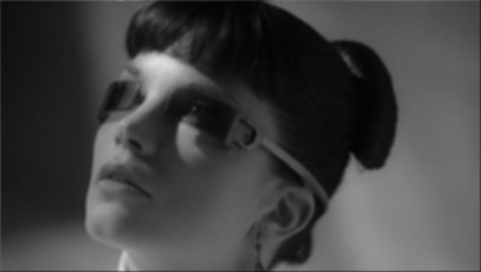
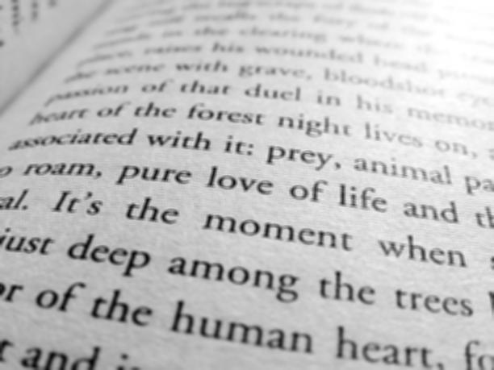
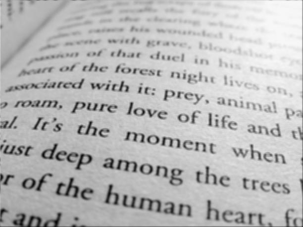

# Цифровая обработка сигналов

## Лабораторная работа № 1: фильтр Гаусса

Примеры результатов работы программы (размеры картинок одинаковы, изменены атвоматическим сжатием md-процессора)

|№|Исходное изображение|Параметры (матрица, сигма)|Фильтр openCV|самостоятельно разработанный фильтр|
|-|-|-|-|-|
|1||7x7, 12|||
|2||17x17, 6|||
|3||5x5, 8|||
|4||11x11, 9|||

