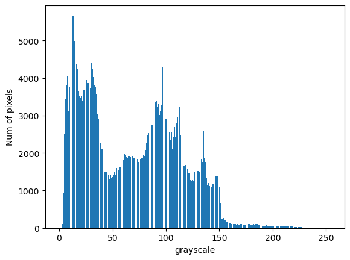

# Цифровая обработка сигналов

## Лабораторная работа № 2: бинаризация изображения

Примеры результатов работы программы (размеры картинок одинаковы, изменены атвоматическим сжатием md-процессора)

|№|Исходное изображение|Фильтр openCV|Фильтр Оцу|Фильтр Брэдли|Гистограмма для Оцу|Threshold для openCV/Оцу|
|-|-|-|-|-|-|-|
|1||||||70/69|
|2||||||121/122|
|3||||||144/134|
