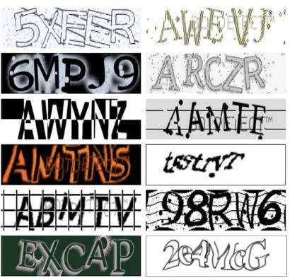
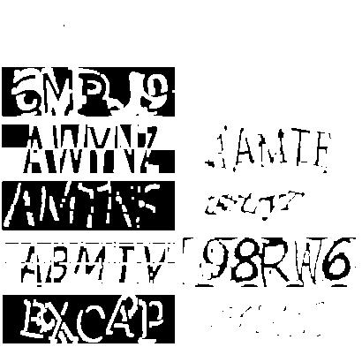
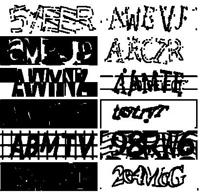
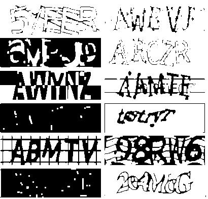
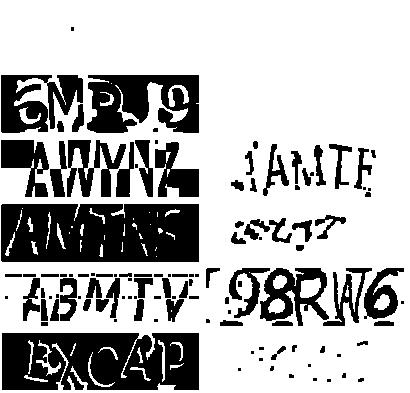
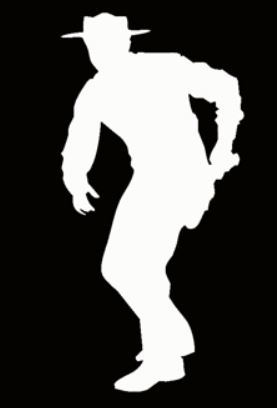
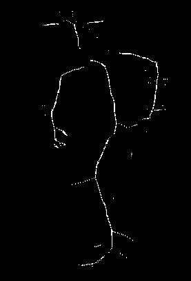

# Цифровая обработка сигналов

## Лабораторная работа № 3: методы математической морфологии

Примеры результатов работы программы (размеры картинок одинаковы, изменены атвоматическим сжатием md-процессора)

|№|Исходное изображение|Измененное изображение|Метод|Структурный элемент|Размер|Итерации|
|-|-|-|-|-|-|-|
|1|||Дилатация|Прямоугольник|3х3|1|
|2|||Ерозия|Прямоугольник|3х3|1|
|3|||Размыкание|Прямоугольник|3х3|1|
|4|||Замыкание|Прямоугольник|3х3|1|
|5|||Условноая дилатация|Прямоугольник|3х3|1|
|6|||Морфологический скелет|Прямоугольник|3х3|1|