# Цифровая обработка сигналов

## Лабораторная работа № 4: Определение границ изображения

Примеры результатов работы программы (размеры картинок одинаковы, изменены атвоматическим сжатием md-процессора)

|№|Детектор|bird_small.jpg - бинаризированное|bl2049_small.jpg - в оттенках серого|
|-|-|-|-|
|1|Исходное изображение|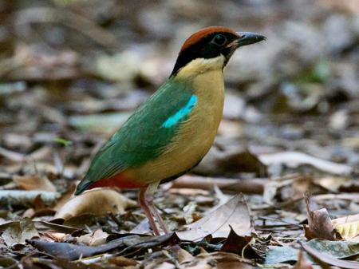||
|2|Детектор Кэнни|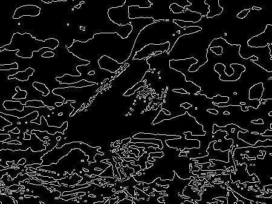|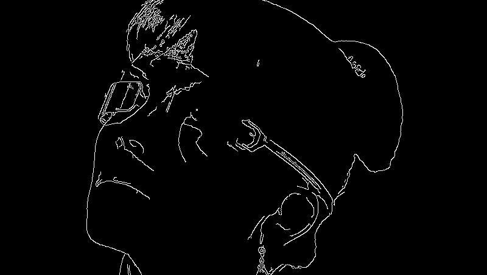|
|3|Детектор Робертса|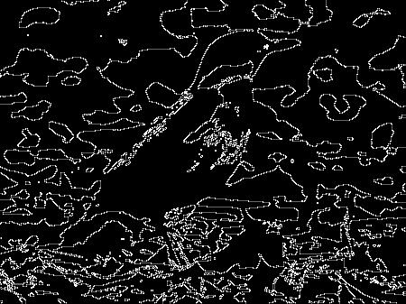|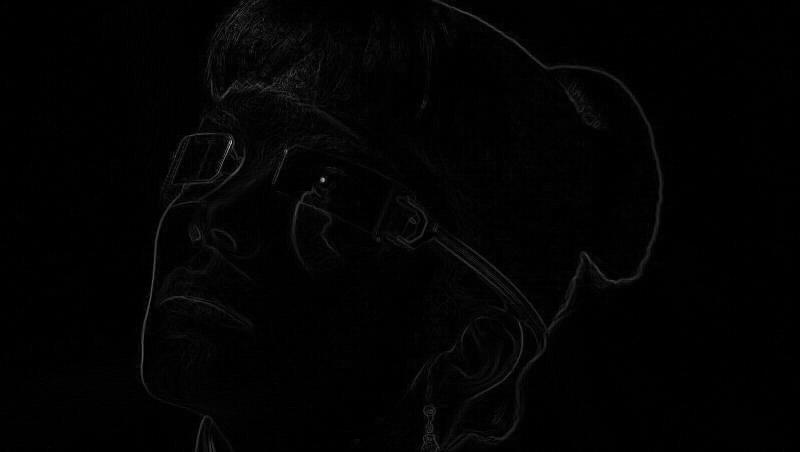|
|4|Детектор Прюитта|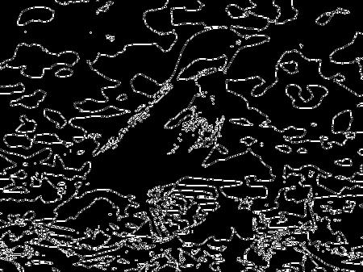|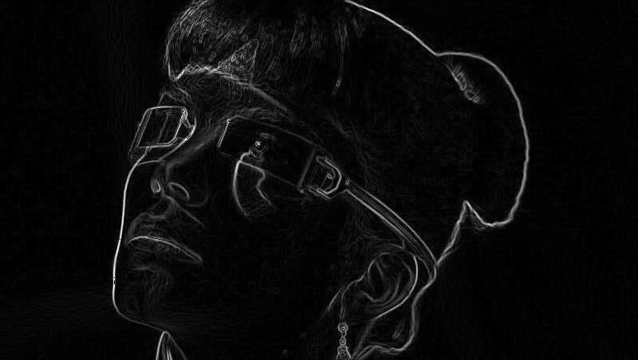|
|5|Детектор Собеля|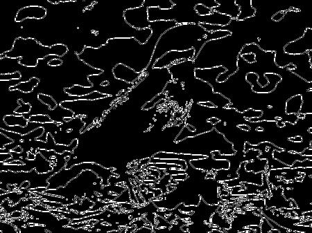|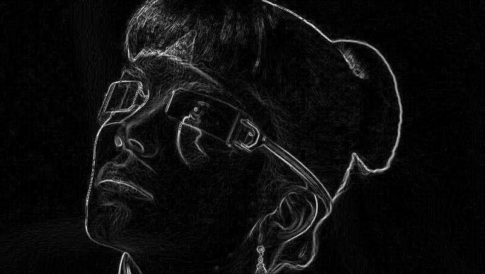|
|6|Детектор Щара||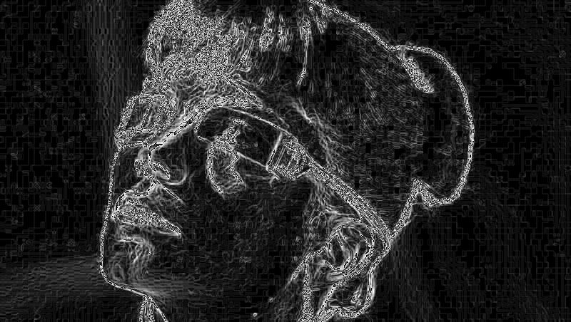|
|7|Детектор Лапласа-Гаусса|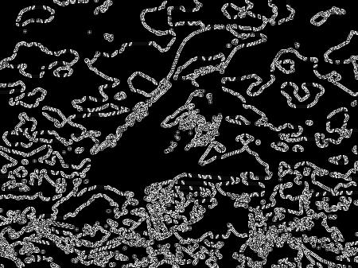|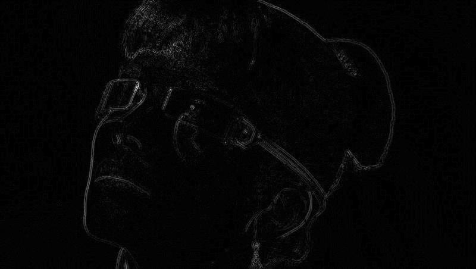|