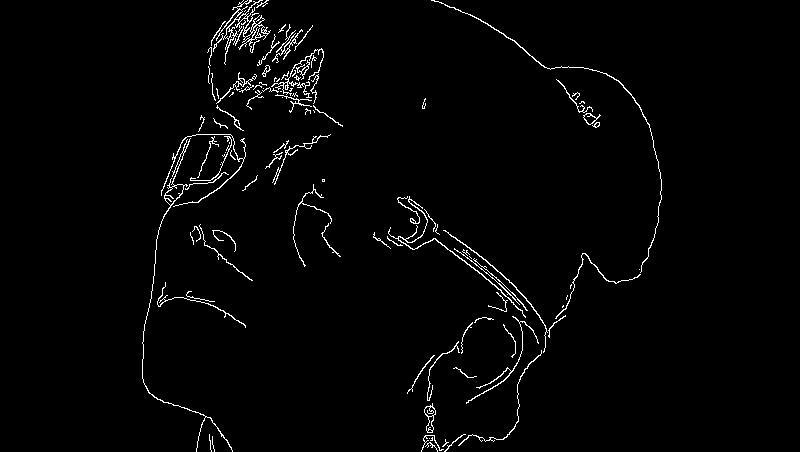
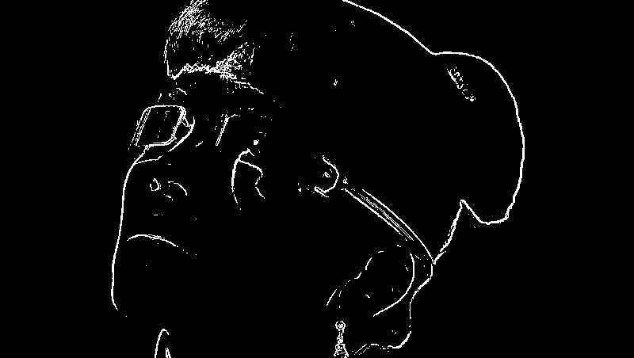
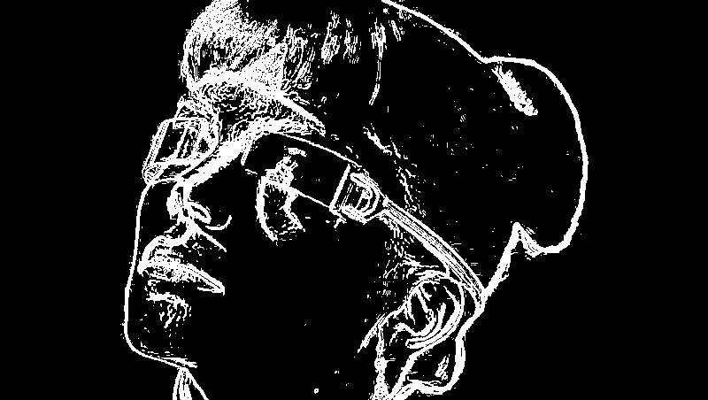
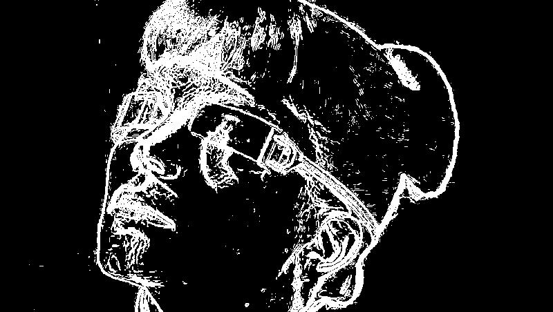
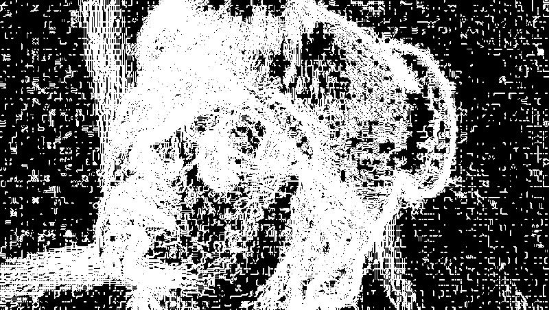
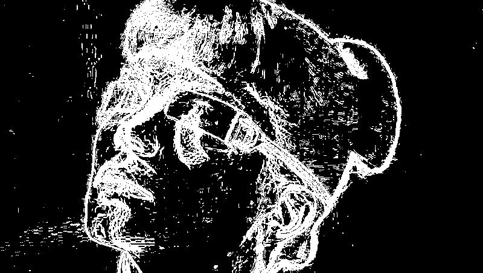
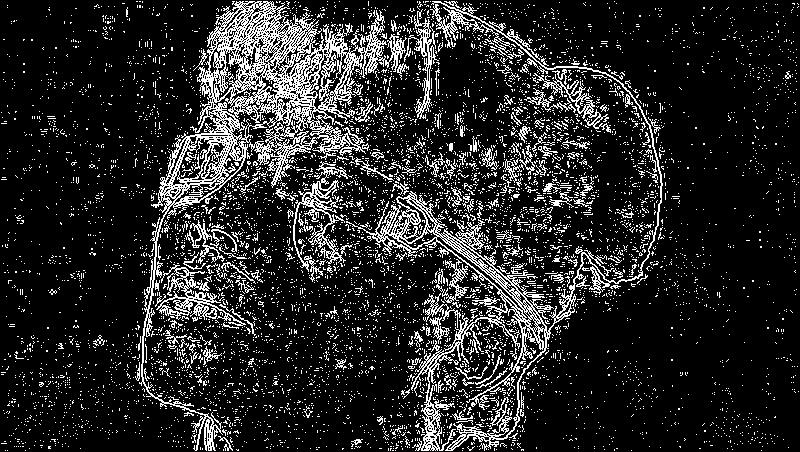
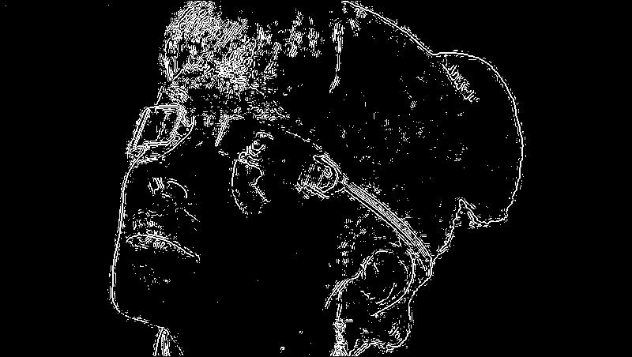

# Цифровая обработка сигналов

## Лабораторная работа № 4: Определение границ изображения

Примеры результатов работы программы (размеры картинок одинаковы, изменены атвоматическим сжатием md-процессора)

|№|Детектор|Изображение|Параметр порогового значения|
|-|-|-|-|
|1|Исходное изображение||...|
|2|Детектор Кэнни||Нижний - 50, верхний - 150|
|3|Детектор Робертса||20|
|4|Детектор Прюитта||20|
|5|Детектор Собеля||20|
|6|Детектор Щара||20|
|7|Детектор Щара||60)|
|8|Детектор Лапласа-Гаусса||0.04|
|9|Детектор Лапласа-Гаусса||0.08|
