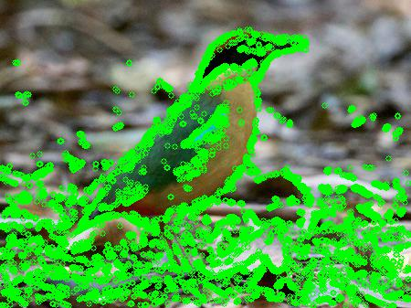
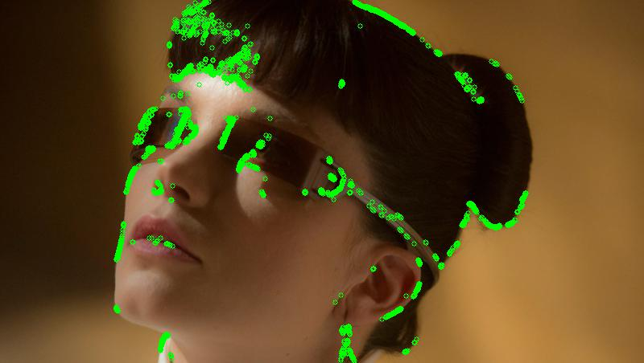
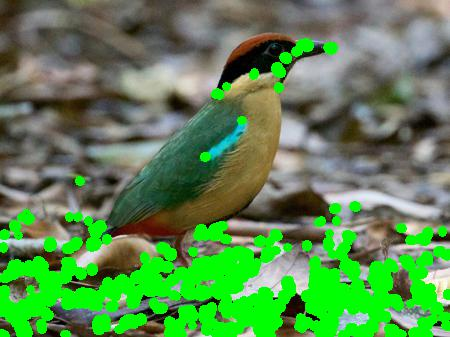
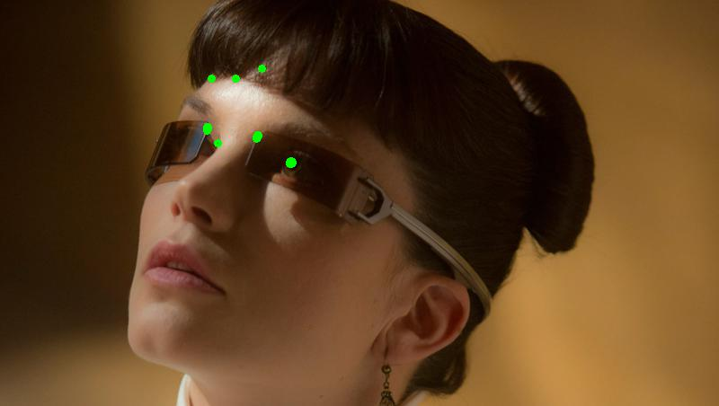
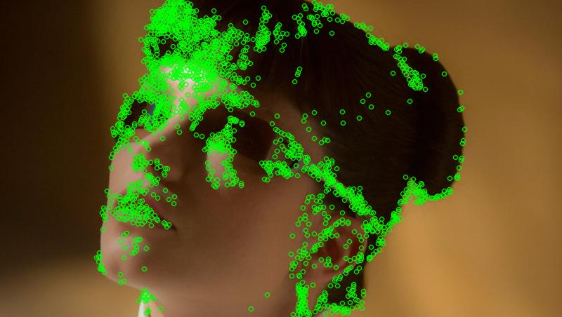

# Цифровая обработка сигналов

## Лабораторная работа № 6: Характерные точки изображения

Примеры результатов работы программы (размеры картинок одинаковы, изменены атвоматическим сжатием md-процессора)

|№|Детектор|bird_small.jpg|Количество углов|bl2049_small.jpg|Количество углов|
|-|-|-|-|-|-|
|1|Исходное изображение||...||...|
|2|Детектор Моровича||Найдено углов: 27724||Найдено углов: 3055|
|3|Детектор Харриса-Стефана||Найдено углов: 7838||Найдено углов: 34|
|4|Детектор FAST||Найдено углов: 3651||Найдено углов: 1989|
